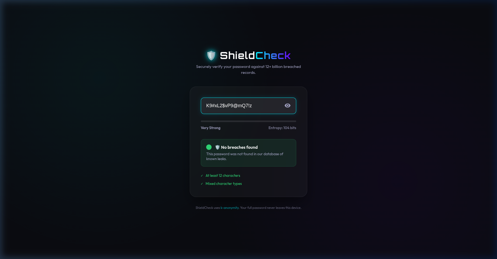

# ShieldCheck | Password Security Analyzer 🛡️

ShieldCheck is a modern, privacy-focused tool built to analyze password strength and check if your credentials have been compromised in data breaches. It integrates with the **HaveIBeenPwned (HIBP) API** using secure, anonymous protocols.

## 🚀 Demo

Below is a recording of ShieldCheck in action, testing both weak (compromised) and strong passwords:

## ✨ Key Features

- **Pwned Passwords Integration**: Checks if a password has appeared in over 12 billion leaked records.
- **Privacy-First (k-Anonymity)**: Uses SHA-1 hashing locally. Only the first 5 characters of the hash prefix are sent to the HIBP API, ensuring your password remains private.
- **Real-Time Strength Meter**: Calculates entropy and visualizes password strength instantly.
- **Modern UI**: Dark mode, glassmorphism aesthetics, and responsive design.

## 🛠️ Built With

- **HTML5 & CSS3**: Custom design system with modern typography (Orbitron/Outfit).
- **Vanilla JavaScript**: For all logic and API interactions.
- **Web Crypto API**: For secure SHA-1 hashing on the client side.

## 📸 Screenshot

## 📖 How to Use

1. Clone or download the repository.
2. Open `index.html` in any modern web browser.
3. Type a password to see its security status.

---
*Created for Cyber Security Project Portfolio.*
# ShieldCheck-Password-Security-Analyzer-
# ShieldCheck-Password-Security-Analyzer-
