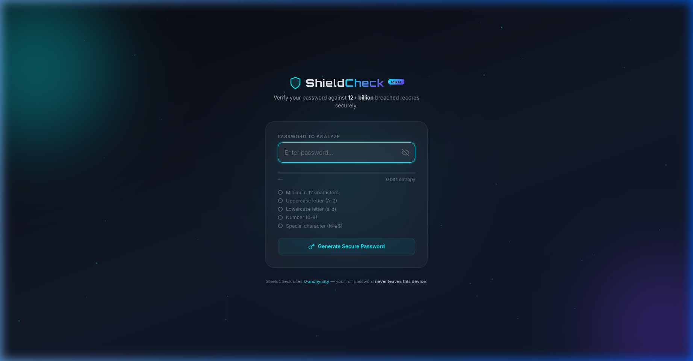
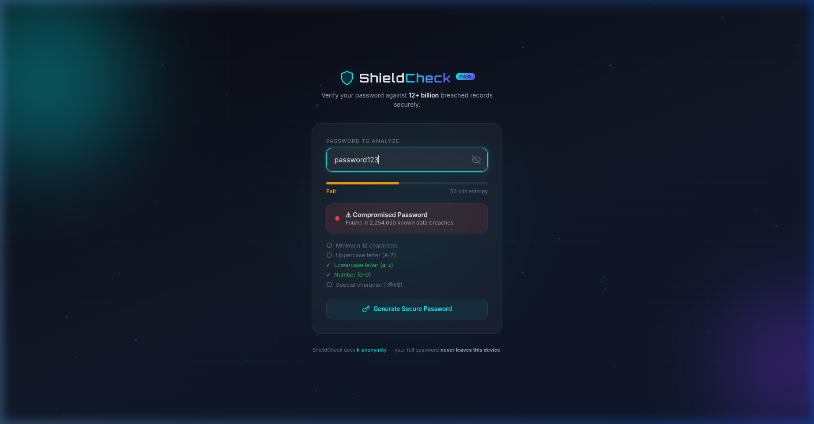
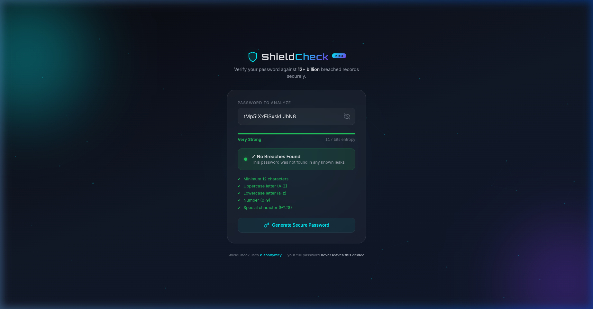

<div align="center">

# 🛡️ ShieldCheck Pro — Password Security Analyzer

<p align="center">
  
  
  
  
  
</p>

<p align="center">
  
  
  
  
  
</p>

<br/>

> **Privacy-first password security analyzer** — checks against 12+ billion breached records  
> using k-anonymity protocol. Your password **never leaves your device**.

<br/>

**[🚀 Quick Start](#-usage) • [🔒 How It Works](#-how-it-works) • [📸 Screenshots](#-screenshots)**

</div>

[](https://shieldcheck-phi.vercel.app)

---

## 🎥 Demo

<div align="center">


*Real-time password analysis with breach detection*

</div>

---

## 📸 Screenshots

<div align="center">

| Initial State | Compromised Detected | Secure Password |
|:---:|:---:|:---:|
|  |  |  |
| *Clean input state* | *Breach alert with count* | *Generated secure password* |

</div>

---

## ✨ Features

| Feature | Description |
|---------|-------------|
| 🔍 **Breach Detection** | Checks against 12+ billion leaked records via HIBP API |
| 🔐 **k-Anonymity** | Only a 5-char SHA-1 hash prefix is sent — password stays local |
| 📊 **Entropy Analysis** | Real-time entropy calculation in bits |
| 💪 **Strength Meter** | Visual: Weak → Fair → Good → Very Strong |
| 🔑 **Password Generator** | One-click 18-char secure password (all character types) |
| 🎨 **Premium UI** | Apple + Cyber glassmorphism with particle animations |
| ⚡ **Instant Results** | Zero page loads — all logic runs in your browser |
| 🚫 **No Backend** | Pure client-side — works offline (except breach check) |

---

## 🔒 How It Works

```
User enters password
        ↓
Web Crypto API generates SHA-1 hash locally
        ↓
First 5 characters of hash sent to HIBP API
(your actual password is NEVER transmitted)
        ↓
HIBP returns all matching hash suffixes
        ↓
Local comparison checks for a match
        ↓
✅ Safe  OR  🚨 Breached X times
```

**The k-anonymity protocol guarantees your password privacy** — even HIBP cannot see it.

---

## 🛠️ Tech Stack

```
Structure:  HTML5 (semantic markup, SVG icons)
Styling:    CSS3 (glassmorphism, FPS-optimized animations)
Logic:      Vanilla JavaScript ES6+ (Web Crypto API, requestAnimationFrame)
API:        HaveIBeenPwned Pwned Passwords (k-anonymity Range API)
Security:   SHA-1 via Web Crypto API (browser-native, no library needed)
```

---

## 🚀 Usage

No installation needed. Just open the file:

```bash
# Clone the repo
git clone https://github.com/builtbysardor/ShieldCheck-Password-Security-Analyzer-.git
cd ShieldCheck-Password-Security-Analyzer-

# Open in browser (no server needed)
open index.html
```

**Or** just download `index.html` and open it directly — it works standalone.

### How to use:
1. Type your password into the input field
2. See real-time strength score and entropy calculation
3. Click **"Check Breach"** to query HIBP
4. Click **"Generate"** for a new secure password

---

## 📁 Project Structure

```
ShieldCheck-Password-Security-Analyzer-/
├── index.html              # Complete app (single file)
├── media/
│   ├── demo_recording.webp       # Live demo GIF
│   ├── screenshot_initial.png    # Initial state
│   ├── screenshot_compromised.png # Breach detection
│   └── screenshot_secure.png     # Generated password
└── README.md
```

---

## 🔮 Roadmap

- [ ] 🌐 **Chrome Extension** — check passwords directly in login forms
- [ ] 📊 **Password history tracker** — track strength improvements over time
- [ ] 🗂️ **Bulk checker** — check multiple passwords from a file
- [ ] 🌍 **Multiple APIs** — add DeHashed & other breach databases
- [ ] 🌙 **Dark/Light toggle** — theme switcher
- [ ] 📱 **PWA support** — installable as a mobile app

---

## ⚠️ Security Note

This tool uses the **k-anonymity model** from HaveIBeenPwned — the same protocol used by major browsers (Firefox Monitor, 1Password, Chrome's Safety Check). Your password is mathematically protected during the API call.

---

## 📄 License

MIT License — see [LICENSE](LICENSE) for details.

---

<div align="center">

**Built with ❤️ by [Sardor Buriyev](https://github.com/builtbysardor)**

⭐ **Star this repo if ShieldCheck helped secure your passwords!**

</div>
